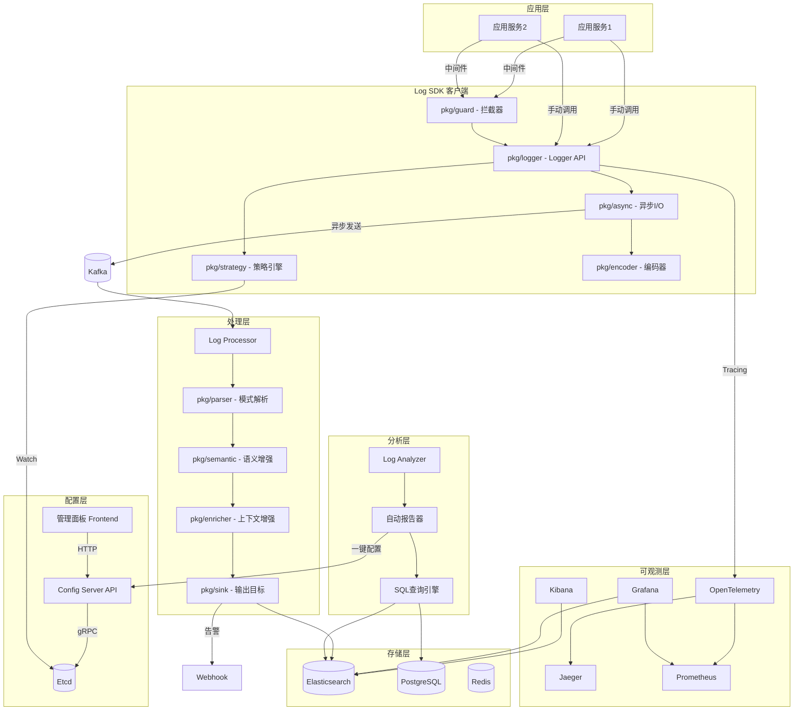
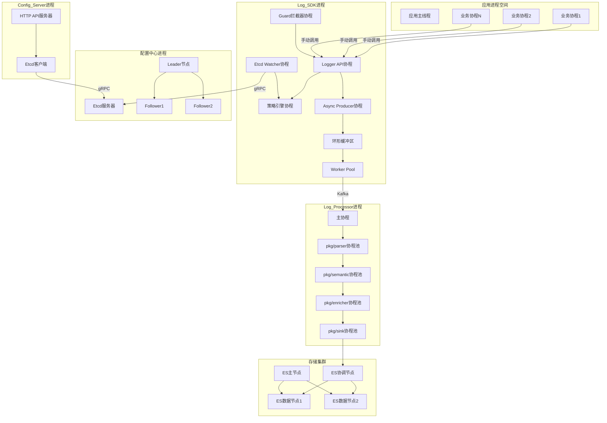
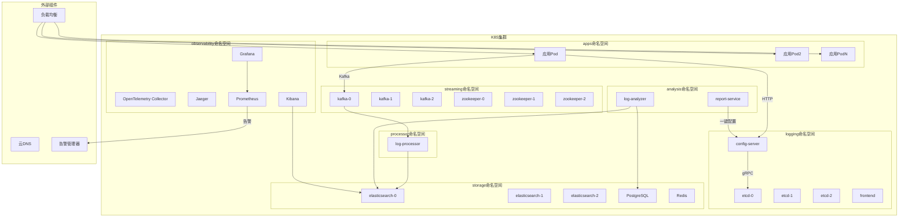
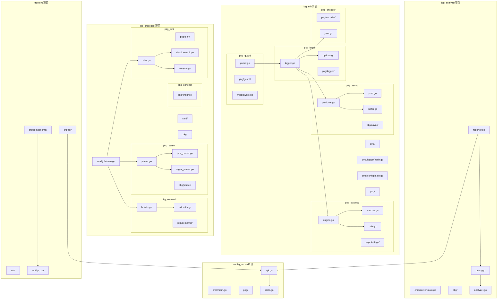
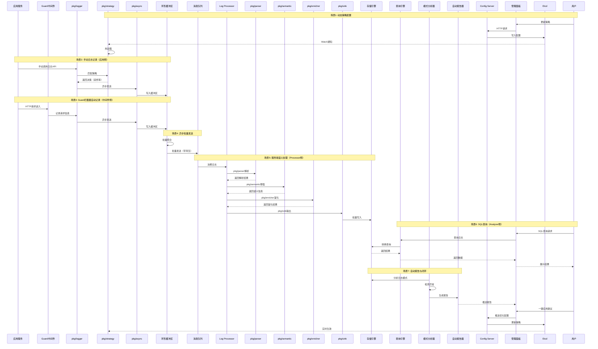

# 支持动态策略配置的语义化日志系统设计与实现

+ [Notion](https://www.notion.so/2e6048c3140c80d08925fe649949b994)
+ [Notebooklm](https://notebooklm.google.com/notebook/a2de9e6e-e6bc-4f1c-a86d-4a5b3a643f03)
+ [NJU tex](https://tex.nju.edu.cn/zh/login/?from=%2Fproject%2Fuser%2F3afe719f-f09d-4585-aab0-30004b7ed475%2F7afd1831-2171-466e-8f34-540039d7f1fb)
+ [Thesis](https://github.com/RZYN2020/522024320224----)

核心目标->分析日志，降本增效：

1. **主论点1**: 应用侧动态配置过滤裁剪策略 Etcd，可以在字符串构建前对日志进行过滤
2. **主论点2**: 语义化日志，可SQL查询，可链路分析
3. **主论点3**: 日志分析 
   1. 日志模式解析 https://zhuanlan.zhihu.com/p/498522888
   2. 使用 SQL api 查询，语义化分析
   3. 使用上面能力，生成日志报告，一键跳转规则配置
4. **从论点**: 高性能（如 Zap, Zerolog）

---

# 第一章 引言

## 1.1 项目背景与研究意义

### 1.1.1 微服务架构下的海量日志治理挑战

随着云计算技术从单体架构向分布式、微服务架构演进，系统的复杂度呈指数级增长。在复杂的调用链条中，日志（Logging）作为可观测性（Observability）的三大支柱之一，是排查线上故障、追踪业务逻辑最直观的依据。

然而，微服务架构带来了“日志爆炸”现象。在字节跳动等大规模互联网场景下，单日产生的日志量可达 PB 级。这种海量数据给系统带来了严峻挑战：

1. **带宽与存储开销：** 昂贵的存储成本与带宽消耗挤占了核心业务资源。
2. **有效信息密度低：** 在“Debug 级日志遍地走”的现状下，关键的错误信息往往被淹没在海量的冗余信息中，导致排错效率低下。

### 1.1.2 现有日志系统的局限性

传统的日志方案（如 ELK、PLG 堆栈）在高度动态化的生产环境中暴露出明显弊端：

1. **配置僵化：** 日志等级调整通常依赖代码修改或进程重启，面对突发流量或线上故障，响应延迟极高。
2. **日志拼接导致的性能问题：** 传统的 `log.Infof("user: %v", user)` 在逻辑执行时，即便日志等级不匹配，依然会触发复杂的对象序列化与字符串拼接，浪费 CPU 资源。
3. **语义缺失：** 纯文本日志缺乏标准化结构，下游处理程序需编写复杂的正则表达式（RegEx）进行解析。
4. **难以分析：** 由于格式不统一，难以进行跨服务的 SQL 化联合查询与链路拓扑分析。
5. **存储成本压力：** 缺乏精细化的裁剪策略，导致无论有用与否，数据全量上云，造成巨大的财务支出。

### 1.1.3 研究意义

本论文旨在设计并实现一套支持**动态策略配置的语义化日志系统**。其核心意义在于通过“主动治理”代替“被动收集”，实现全链路的性能闭环：

- **动态裁剪与前置过滤：** 基于 Etcd 的控制面下发，SDK 能够在字符串构建（Formatting）之前进行策略匹配，实现真正的“零无效开销”过滤。
- **语义化赋能：** 统一日志 Schema，支持标准 SQL 查询与分布式追踪（Tracing）集成，将碎片化的文本转化为具有业务含义的数据资产。
- **闭环优化：** 通过日志模式（Pattern）解析自动识别冗余日志，生成分析报告并一键反向更新策略，形成“产生-分析-治理”的自动化闭环。

## 1.2 国内外研究现状

在工业界，Google 的 Dapper 和 CNCF 旗下的 **OpenTelemetry** 定义了现代可观测性的基本准则。高性能日志库如 **Uber 的 Zap** 与 **Zerolog** 极大地降低了日志记录的分配开销。

在学术界，关于日志模式识别的研究如 **Drain** 算法和基于深度学习的日志异常检测已日趋成熟。然而，如何将高维度的模式分析结果，实时、安全地回馈到应用侧的 SDK 进行动态流量裁剪，仍是目前工业界大规模生产环境中的一个探索热点。

## 1.3 本文主要工作

**设计了一套高性能日志 SDK：** 采用 Go 语言开发，实现了基于原子变量配置的热加载机制，支持在字段序列化前进行多维度裁剪。

**构建了语义化处理流水线（Log Processor）：** 实现了从原始日志到结构化数据的自动映射、验证与富化。

**开发了智能日志分析器（Log Analyzer）：** 引入日志聚类算法，自动识别高频冗余模板，并生成降级配置建议。

**实现了基于控制面的动态配置中心：** 结合 Etcd 实现了配置的秒级下发与灰度控制。

**验证与测评：** 通过 Benchmark 测试与模拟生产环境压测，验证了系统在降低 CPU 损耗与节省存储空间方面的显著效果。

## 1.4 论文组织结构

本文共分为六章，具体安排如下：

- **第一章：引言。** 阐述研究背景、核心问题及本文贡献。
- **第二章：相关技术综述。** 介绍 Go 高性能编程、分布式协调服务及可观测性相关理论。
- **第三章：日志系统分析与设计。** 详述系统 4+1 架构视图、语义模型及核心机制。
- **第四章：日志系统的实现。** 深入探讨 SDK 性能优化、服务端组件及闭环控制面的编码实践。
- **第五章：日志系统的测试。** 给出单元测试、功能测试及基于吞吐量与存储损耗的对比测评结果。
- **第六章：总结与展望。** 总结研究成果，并指出系统未来的改进方向。

# 第二章 相关技术综述

## 2.1 GoLang

## 2.2 Etcd

## 2.3 Kibana

## 2.4 OpenTelemetry

## 2.5 React

## 2.6 Gin

## 2.7 Elasticsearch

## 2.8 Kafka

## 2.9 本章小节 

# 第三章 日志系统分析与设计

## 3.1 系统整体概述

本系统采用分层架构设计：

1. **采集层**：SDK，负责日志收集和发送
2. **缓冲层**：Kafka，削峰填谷，解耦应用与存储
3. **处理层**：Log Processor，语义增强和验证
4. **存储层**：Elasticsearch，日志存储和检索
5. **查询层**：SQL 查询引擎，支持标准 SQL
6. **配置层**：Etcd + Config Server，动态策略配置
7. **分析层**：自动报告生成，闭环配置优化

## 3.3 日志系统整体设计

### 3.3.1 日志系统核心机制设计

### 3.3.2 系统 4+1 架构视图

#### 逻辑视图 (Logical View)

**关键设计**：
- **SDK 轻量化**：语义处理从 SDK 移到 Log Processor（服务端）
- **模块化 SDK**：logger、guard、strategy、async、encoder 五大核心模块
- **手动日志 API**：应用代码手动调用 Logger API 记录日志
- **闭环设计**：Reporter 分析结果可一键配置到 Etcd

#### 进程视图 (Process View)

#### 部署视图 (Deployment View)

#### 开发视图 (Development View)

#### 场景视图 (Scenario View)

## 3.4 日志系统模块设计

### 3.4.1 SDK 设计

https://darjun.github.io/2020/02/07/godailylib/log/

https://darjun.github.io/2020/02/07/godailylib/logrus/

https://darjun.github.io/2020/04/23/godailylib/zap/

https://darjun.github.io/2020/04/24/godailylib/zerolog/

### 3.4.2 Log Processor 设计

### 3.4.3 Log Analyzer 设计

## 3.5 本章小结

# 第四章 日志系统的实现

## 4.1 Log SDK 的实现

## 4.2 Log Processor 的实现

## 4.3 Log Analyzer 的实现

## 4.4 Control Plane 的实现

## 4.6 本章小结

# 第五章 日志系统的测试

## 5.1 系统测试

## 5.2 单元测试

## 5.3 功能测试

## 5.4 本章小结

# 第六章 总结与展望

## 6.1 总结

## 6.2 展望

## 参考文献

## 致谢
