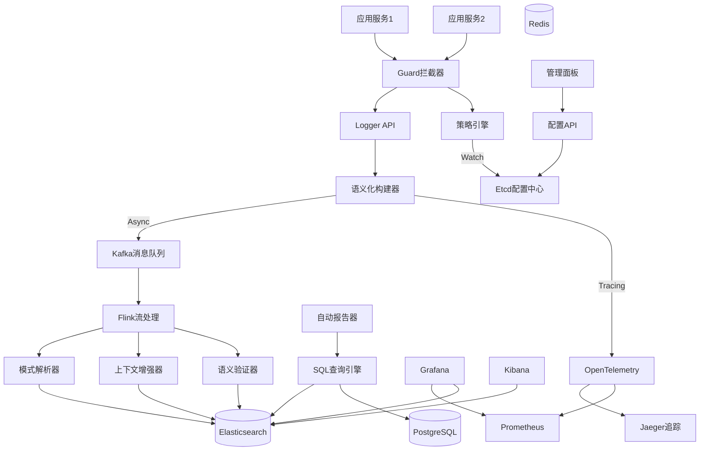
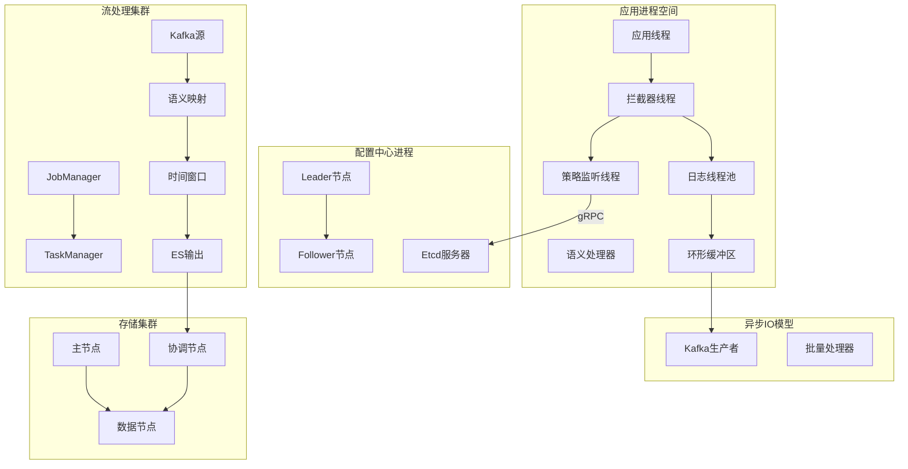
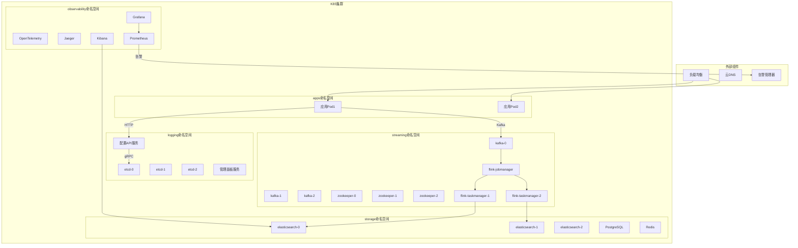
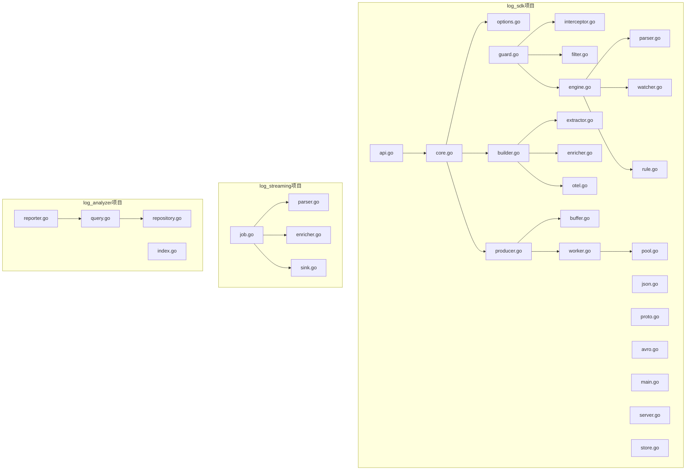
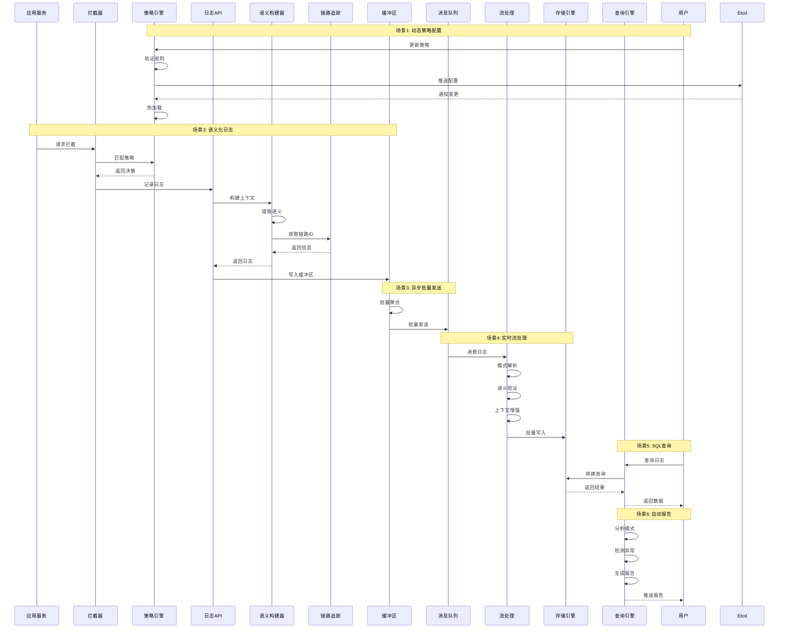

# 支持动态策略配置的语义语义化日志系统设计与实现

核心论点：

1. 高性能 （如 Zap, Zerolog）
2. 应用侧动态配置 Etcd； SDK前置拦截（Guard）
3. 语义化→sql查询→全链路可观测性融合 OpenTelemetry
4. 模式解析与自动报告 https://zhuanlan.zhihu.com/p/498522888

+ [Notion](https://www.notion.so/2e6048c3140c80d08925fe649949b994)
+ [Notebooklm](https://notebooklm.google.com/notebook/a2de9e6e-e6bc-4f1c-a86d-4a5b3a643f03)
+ [NJU tex](https://tex.nju.edu.cn/zh/login/?from=%2Fproject%2Fuser%2F3afe719f-f09d-4585-aab0-30004b7ed475%2F7afd1831-2171-466e-8f34-540039d7f1fb)
+ [Thesis](https://github.com/RZYN2020/522024320224----)

# 第一章 引言

## 1.1 项目背景

## 1.2 国内外发展现状及分析

## 1.3 本文主要工作

## 1.4 论文的组织结构

# 第二章 相关技术综述

# 第三章 日志系统分析与设计

## 3.1 系统整体概述

## 3.2 日志系统需求分析

## 3.3 日志系统整体设计

### 3.3.1 系统 4+1 架构视图

#### 逻辑视图 (Logical View)

#### 进程视图 (Process View)

#### 部署视图 (Deployment View)

#### 开发视图 (Development View)

#### 场景视图 (Scenario View)

### 3.3.2 架构视图说明

| 视图 | 描述 | 关键组件 |
|------|------|----------|
| **逻辑视图** | 系统的功能组件和它们之间的关系 | SDK层、Etcd、Kafka、Flink、ELK、OpenTelemetry |
| **进程视图** | 进程、线程及其并发交互 | Ring Buffer、Worker Pool、Flink Operators、ES Cluster |
| **部署视图** | 物理部署和基础设施 | K8s集群、StatefulSet、Deployment、监控体系 |
| **开发视图** | 代码组织和模块依赖 | pkg结构、策略引擎、语义化处理、流处理Job |
| **场景视图** | 关键用例和交互流程 | 动态配置、日志记录、流处理、查询分析 |

## 3.4 日志系统模块设计

## 3.5 本章小节

# 第四章 日志系统的实现

## 4.1 Logger API 模块的实现

## 4.2 策略引擎模块的实现

**Dynamic Strategy Engine**

## 4.3 核心处理模块的实现

**Semantic Context Builder**

## 4.4 异步 I/O 模块的实现

## 4.5 编码器模块的实现

## 4.6 策略配置控制面的实现

## 4.7 本章小节

# 第五章 日志系统的测试

## 5.1 系统测试

## 5.2 单元测试

## 5.3 功能测试

## 5.4 本章小节

# 第六章 总结与展望

## 6.1 总结

## 6.2 展望

## 参考文献

## 致谢
